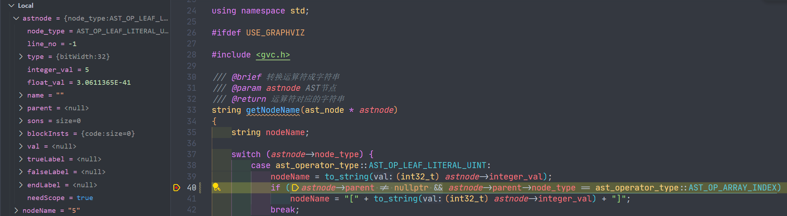

# 数组实现技术细节

## exp07遗留问题
stmt:T_RETURN expr T_SEMICOLON 中expr应该为可选?，需要后续修改ASTVisitor实现

## 错误处理
暂且忽略错误处理，后续完成

Next Step: 修改左值与函数形参中对维度的处理（有可能也需要修改IR实现），将维度信息从id_node转移到一个新节点，这个新节点保存id_node与维度信息。

## IR处理流程
创建数组类型 -> 书写语义分析 -> 

左值AST处理时不可能将各个索引对应的类型绑定到type上，这里必须放在IR生成中进行。

使用AST_OP_ASSIGN取代赋初值疑似不可行。

```
AST_OP_VAR_DECL
	|
	+---AST_OP_LEAF_TYPE
	|
	+---AST_OP_LEAF_VAR_ID
	|
	+---AST_OP_ARRAY_DIM
	|
	+---AST_OP_ARRAY_DIM

ArrayType
	|
	+---ArrayType
	|		|
	|		+---IntegerType
	|		|
	|		+---numElements
	|
	+---numElements


AST_OP_ARRAY_INDEX
	|
	+---AST_OP_ARRAY_INDEX
	|		|
	|		+---AST_OP_LEAF_VAR_ID
	|		|
	|		+---AST_OP_ARRAY_INDEX array
	|				|
	|				+---AST_OP_ARRAY_INDEX
	|				|		|
	|				|		+---AST_OP_LEAF_VAR_ID
	|				|		|
	|				|		+---AST_OP_LEAF_LITERAL_UINT 1
	|				|
	|				+---AST_OP_LEAF_LITERAL_UINT 5
	|
	+---AST_OP_ARRAY_INDEX
			|
			+---AST_OP_LEAF_VAR_ID array
			|
			+---AST_OP_ARRAY_INDEX
					|
					+---AST_OP_ARRAY_INDEX
					|		|
					|		+---AST_OP_LEAF_VAR_ID array
					|		|
					|		+---AST_OP_LEAF_LITERAL_UINT 2
					|
					+---AST_OP_LEAF_LITERAL_UINT 6


AST_OP_ARRAY_INDEX
	|
	+---AST_OP_ARRAY_INDEX
	|		|
	|		+---AST_OP_LEAF_VAR_ID
	|		|
	|		+---AST_OP_LEAF_LITERAL_UINT m
	|
	+---AST_OP_LEAF_LITERAL_UINT k
```

```
%t10 = mul %l5, 4 				; %l5=index 元素偏移转换成字节偏移
%t11 = add %l2, %t10 			; %l2=base 数组元素首地址+偏移得到元素的字节位置
%l6 = *%t11 					; 从内存中取值，假定取4个字节的数据

%t5 = mul %l2, 10				; %l2=m
%t6 = add %t5, %l3				; %l3=k
%t7 = mul %t6, 4 				; (m*10+k)*sizeof(int)
%t8 = add %l1, %t7 				; %t7=base 数组元素首地址+元素的字节偏移后的指针
%l4 = *%t8 						; 从内存中获取i32 类型的元素值
```

乘法加法写的有问题

地址访问指令必须写

共享节点问题

else悬空

and or处理单变量时忽略将左值修改为比较命令的结果
and中标签继承写错

最后实参传入时考虑类型是否正确

为什么没父节点又没子节点？？？
